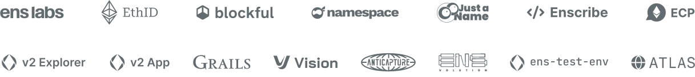

<!-- VERTICAL WHITESPACE -->

 

<!-- BANNER IMAGE -->

  <a href="https://ensnode.io">
    <picture>
      <source media="(prefers-color-scheme: dark)" srcset=".github/assets/ensnode-banner-dark.svg">
      
    </picture>
  </a>

<!-- VERTICAL WHITESPACE -->

 

# ENSNode

[ENSNode](https://ensnode.io) is the full-stack development platform for [ENSv2](https://ens.domains/ensv2).

Use ENSNode to achieve full ENSv2 readiness even before ENSv2 launches.

The easiest way to get started is through the new [ENS Omnigraph API](https://ensnode.io/docs/integrate/omnigraph) — the world's first and only API to support querying the full state of both ENSv1 and ENSv2 in a single unified API.

## Join the ENS ecosystem that's already building on ENSNode

<!-- FEATURED ENSNODE INTEGRATORS -->

  <a href="https://ensnode.io/docs/integrate">
    <picture>
      <source media="(prefers-color-scheme: dark)" srcset=".github/assets/ensnode-integrators-dark.svg">
      
    </picture>
  </a>

## Get your app ENSv2 ready

- 🚀 **Quickstart:** [ensnode.io/docs/integrate](https://ensnode.io/docs/integrate)
- 📚 **Docs:** [ensnode.io](https://ensnode.io)
- 💬 **Telegram:** [t.me/ensnode](https://t.me/ensnode)
- 🙌 **Contribute:** See [CONTRIBUTING.md](CONTRIBUTING.md)

## Sponsors

[NameHash](https://namehashlabs.org) is backed by the [ENS DAO](https://ensdao.org/) as an official ENS Service Provider.

## License

Licensed under the MIT License, Copyright © 2025-present [NameHash Labs](https://namehashlabs.org).

See [LICENSE](./LICENSE) for more information.
