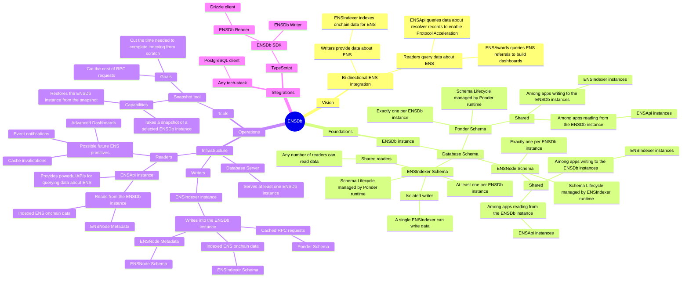

```mermaid
mindmap
  root((ENSDb))
    Vision
      Bi-directional ENS integration
        Writers provide data about ENS
          ENSIndexer indexes onchain data for ENS
        Readers query data about ENS
          ENSAwards queries ENS referrals to build dashboards
          ENSApi queries data about resolver records to enable Protocol Acceleration

    Foundations
      ENSDb instance
        Database Schema
          Ponder Schema
            Exactly one per ENSDb instance
            Schema Lifecycle managed by Ponder runtime
            Shared
              Among apps writing to the ENSDb instances
                ENSIndexer instances
              Among apps reading from the ENSDb instance
                ENSApi instances
          ENSNode Schema
            Exactly one per ENSDb instance
            Schema Lifecycle managed by ENSIndexer runtime
            Shared
              Among apps writing to the ENSDb instances
                ENSIndexer instances
              Among apps reading from the ENSDb instance
                ENSApi instances
          ENSIndexer Schema
            At least one per ENSDb instance
            Schema Lifecycle managed by Ponder runtime
            Isolated writer
              A single ENSIndexer can write data
            Shared readers
              Any number of readers can read data

    Operations
      Infrastructure
        Database Server
          Serves at least one ENSDb instance
        Writers
          ENSIndexer instance
            Writes into the ENSDb instance
              Cached RPC requests
                Ponder Schema
              Indexed ENS onchain data
                ENSIndexer Schema
              ENSNode Metadata
                ENSNode Schema
        Readers
          ENSApi instance
            Reads from the ENSDb instance
              Indexed ENS onchain data
              ENSNode Metadata
            Provides powerful APIs for querying data about ENS
          Possible future ENS primitives
            Event notifications
            Cache invalidations
            Advanced Dashboards

      Tools
        Snapshot tool
          Capabilities
            Takes a snapshot of a selected ENSDb instance
            Restores the ENSDb instance from the snapshot
          Goals
            Cut the cost of RPC requests
            Cut the time needed to complete indexing from scratch

    Integrations
      TypeScript
        ENSDb SDK
          ENSDb Reader
            Drizzle client
          ENSDb Writer
      Any tech-stack
        PostgreSQL client
```
