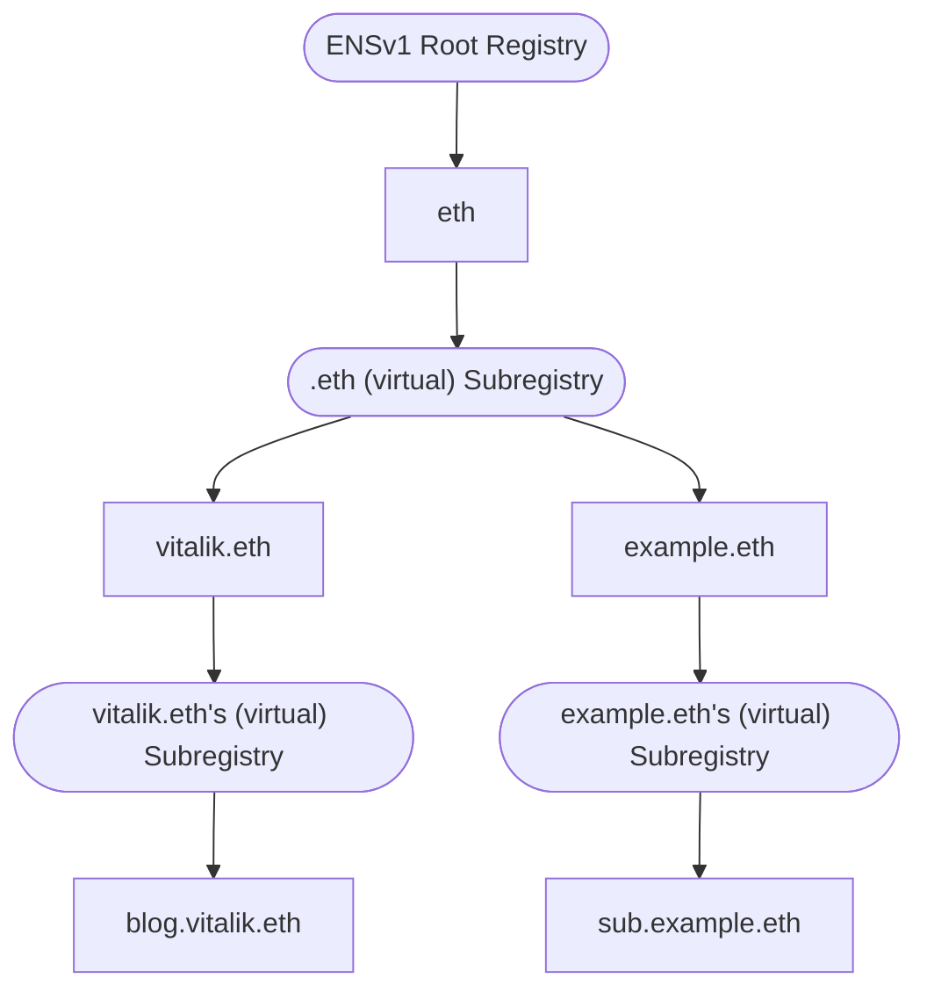
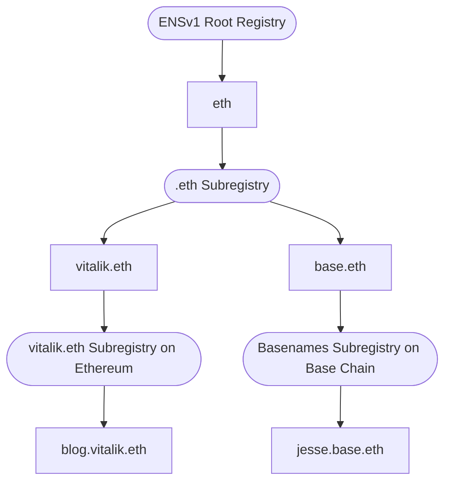

import { CardGrid, LinkCard, Aside } from "@astrojs/starlight/components";

While the [ENS Omnigraph API](/docs/integrate/omnigraph) abstracts away most of the complexity of the ENS protocol, there are still some core concepts that are useful to learn. These concepts will help you understand _how_ the Omnigraph presents ENSv1 and ENSv2 through a single unified schema. You don't need to master these concepts to build your first Omnigraph query, but as you level-up to building more advanced ENS features in your app, these concepts will help you to understand how the Omnigraph represents the state of the ENS protocol.

<Aside type="caution" title="ENSv1 and ENSv2 will coexist">
  Unlike traditional software, **ENSv2 does not replace ENSv1**. When ENSv2 launches, ENSv1 doesn't
  stop existing — both protocols coexist onchain, at the same time, even though ENSv2 has a
  substantially different onchain data model from ENSv1.

That's exactly why developers building on ENS need ENSNode and the ENS Omnigraph API: it's the
world's first and only service delivering the **unified ENSv1 + ENSv2 data access** that building on
ENS requires. The concepts below explain how the Omnigraph presents that unified state.

</Aside>

## What is a Namegraph?

A **Namegraph** is the native onchain data model of ENSv2: it represents names not as a flat mapping of namehashes in a Nametable (as in ENSv1), but as a graph of `Registry → Domain → Registry → Domain → …`. This graph may be cyclic, and within the ENSv2 protocol an unbounded number of _disjoint_ (not connected) Namegraphs will exist. Within the unified ENS protocol (v1+v2) there will exist many Namegraphs, at the very least those headed by the ENSv1 Root Registry, Basenames, Lineanames, 3DNS, and the ENSv2 Root Registry.

Because ENSv1 names do not actually have on-chain Subregistries, the Unigraph represents this relationship with an `ENSv1VirtualRegistry`.



You navigate the graph by following a Domain to its Subregistry to its child Domains, and so on:

```graphql title="example.gql"
query Namegraph {
  # reference a Domain by name
  domain(by: { name: "eth" }) {
    # this is the Registry that "eth" exists within
    registry { id contract { chainId address } }

    # "eth"'s parent Domain (if any)
    parent { id }

    # the Subregistry that "eth" declares
    subregistry {
      domains {
        edges {
          node {
            # get each domain's (beautified) name
            canonical { name { beautified } }
          }
        }
      }
    }

    # Domain.subdomains is short form of Domain.subregistry.domains
    subdomains { edges { node { canonical { name { beautified } } } } }
  }
}
```

## What is the Unigraph?

The **Unigraph** is the entire collection of these disjoint ENSv2 Namegraphs and multiple ENSv1 Nametables, combined together into a single unified data model using ENS Resolution semantics. Navigating the Unigraph from `"eth"` down to `"vitalik.eth"` and beyond looks identical regardless of whether the underlying entities are ENSv1 or ENSv2.

The `unigraph` [ENSNode plugin](/docs/integrate/integration-options/ensnode-plugins), implemented in [ENSIndexer](/docs/services/ensindexer), is what builds this unified model. The Unigraph models many Namegraphs and Nametables together — for example, the ENSv1 Nametable rooted at the ENSv1 Root Registry and the ENSv2 Namegraph rooted at the ENSv2 Root Registry. It also includes special support for unifying multiple ENSv1 Nametables across multiple chains into the Unigraph, including: Basenames (`.base.eth`), Lineanames (`.linea.eth`), and 3DNS names (`.box`).



The same query shape works for any indexed name regardless of chain or protocol version — here, a Basename on Base:

```graphql title="example.gql"
query Basenames {
  domain(by: { name: "jesse.base.eth" }) {
    canonical { name { interpreted } }
  }
}
```

## Unigraph with ENSv2

Once ENSv2 launches, the ENSv2 Namegraphs will exist in parallel with the ENSv1 Nametables. When referencing a Domain by `name`, the Omnigraph will start at the **ENSv2 Root Registry**, and traverse the Unigraph to find the appropriate Domain. Once `.eth` names are reserved in the ENSv2 `EthRegistry`, then the **ENSv2 Domain** will be returned, since that's the Domain that would be referenced during resolution. This is part of why it's important to reference specific Domains by `id`; once `vitalik` has been reserved in the ENSv2 EthRegistry, the ENS protocol considers the ENSv2 Domain (_not_ the ENSv1 Domain) to be the 'real' one. That said, after the `.eth` names are reserved (but before they're individually migrated), their resolver will be the `ENSv1Resolver`, forwarding resolution to the ENSv1 Nametable.

The end result is that there are **two** Domains considered to be "vitalik.eth", one in an ENSv1 Nametable and one in an ENSv2 Namegraph.

```graphql title="example.gql"
query ByProtocolVersion {
  # before ENSv2 launches: returns ENSv1 vitalik.eth
  #  after ENSv2 launched: returns ENSv2 vitalik.eth
  domain(by: { name: "vitalik.eth" }) { id }

  # always returns the protocol-specific version of vitalik.eth
  domains(where: { name: { eq: "vitalik.eth" }, version: ENSv1 }) {
    edges { node { id } }
  }
}
```

:::note[Domain `id` vs `name`]
This is part of why there's a distinction between a Domain's `id` (the stable, unique reference that always refers to the same onchain entity) and a Domain's `name` (which may change over time). See below for further discussion.
:::

## Canonicality

Given that a Domain entity (say, the `sub` in `sub.example.eth`) can be reached by infinitely many aliases (for example, `sub.other.eth`), it becomes important to determine a _canonical_ reference to the Domain — this is the **Canonical Name**. Canonicality is also connected to nameability within the Unigraph; if an ENSv2 Domain exists on-chain but isn't eventually connected to the ENSv1 or ENSv2 Root Registry via a series of canonical names, **it doesn't have a Canonical Name!**

Within the Omnigraph API the complexity of the namegraphs is reduced, and all Canonical Domains are queryable, searchable, and addressable by said Canonical Name. Domains that are not canonical are _still_ referenceable by `id` (eg. `domain(by: { id: DomainId! })`).

Canonical Domains have a `Domain.canonical` field hosting the canonicality-derived fields such as `name`, `node`, `depth` (i.e. 2 for `vitalik.eth`), and `path` from the ENS root.

```graphql title="example.gql"
query Canonicality {
  domain(by: { name: "vitalik.eth" }) {
    canonical {
      name {
        interpreted # the InterpretedName
        beautified  # the ENSIP-15 BeautifiedName
      }
      node   # namehash(name)
      depth  # i.e. 2 for "vitalik.eth"
      path { id } # [Domain("eth"), Domain("vitalik.eth")]
    }
  }
}
```

## Stable IDs vs. Namegraph addressing

Every entity in the Omnigraph has an `id` — a nominally-typed, stable reference to a specific on-chain entity (`DomainId`, `RegistryId`, `RegistrationId`, etc.).

For Domains, when you already have an `id` and want to reference the _exact same_ on-chain entity, query it by `id`: `domain(by: { id: "..." })` which is stable across time, even if its Canonical Name could change.

Addressing a Domain by **name** is a different operation. It's **forward traversal of the Unigraph**: `domain(by: { name: "vitalik.eth" })` walks from the Root Registry (ENSv1 or ENSv2 if defined) → `"eth"` in that Registry → the Registry that `"eth"` points at (the EthRegistry) → `"vitalik"` in that Registry. The Domain returned is whichever on-chain entity (if any) would be identified during Forward Resolution.

These two views are not interchangeable:

- The `id` you receive from a name lookup _is_ the stable reference to the on-chain entity that the Unigraph currently resolves `"vitalik.eth"` to.
- But `"vitalik.eth"` is not a stable reference to that entity. A Domain's position in the Unigraph can be re-parented or re-aliased — and tomorrow, `"vitalik.eth"` may resolve to an entirely different on-chain Domain, which may have a different resolver with different records.

Address the exact on-chain entity by `id` — stable across time:

```graphql title="example.gql"
query ById {
  domain(by: { id: "..." }) {
    canonical { name { interpreted } }
  }
}
```

Address by `name` to perform forward traversal — you get whichever entity the name resolves to right now:

```graphql title="example.gql"
query ByName {
  domain(by: { name: "vitalik.eth" }) {
    __typename  # could be ENSv1Domain or ENSv2Domain
    id          # vitalik.eth could refer to a different Domain over time, but id is always stable
    canonical { name { interpreted } }
  }
}
```

:::note[Rule of Thumb]
Address by `name` when you're answering "which Domain would records come from if resolved right now"; address by `id` when you're answering "what's the latest state of this specific on-chain entity?".

So if you're writing an application that shows a profile for `vitalik.eth`, `by: { name: "vitalik.eth" }`. If you're writing an application where users are managing their on-chain Registry contracts and the Domains they own, reference each `by: { id: "..." }`.
:::

## Polymorphism via GraphQL interfaces

`Domain`, `Registry`, and `Registration` are GraphQL **interfaces**, with concrete types implementing each:

- `Domain` → `ENSv1Domain`, `ENSv2Domain`, `UnindexedDomain`
- `Registry` → `ENSv1Registry`, `ENSv1VirtualRegistry`, `ENSv2Registry`
- `Registration` → `BaseRegistrarRegistration`, `NameWrapperRegistration`, `ThreeDNSRegistration`, `ENSv2RegistryRegistration`, `ENSv2RegistryReservation`

Shared fields are available unconditionally on the interface. Protocol- or implementation-specific fields are reached via typed inline fragments — `... on ENSv1Domain { rootRegistryOwner }`, `... on ENSv2Domain { tokenId }`, `... on BaseRegistrarRegistration { wrapped { fuses } }`, `... on NameWrapperRegistration { fuses }`. The result is a single query that compiles, type-checks, and returns the right fields for whichever concrete type each record turns out to be.

```graphql title="example.gql"
query Polymorphism {
  domain(by: { name: "vitalik.eth" }) {
    __typename

    ... on ENSv1Domain {
      # the owner of the Domain in the ENSv1 Root Registry
      rootRegistryOwner { address }
    }

    ... on ENSv2Domain {
      # ENSv2 Domains are identified by a `tokenId` within their Registry
      tokenId
    }
  }
}
```

## UnindexedDomain

Not every resolvable Domain is in the index. A Domain can be **resolvable but unindexed** when an ancestor on its namegraph path carries an [ENSIP-10](https://docs.ens.domains/ensip/10) wildcard Resolver — for example off-chain / CCIP-Read subnames, wildcard subnames, and unindexed 3DNS names. The Omnigraph represents these with the `UnindexedDomain` type, so that a `domain(by: { name })` lookup still returns a usable Domain even when there's no indexed onchain entity behind that exact name.

An `UnindexedDomain` implements the `Domain` interface — it still has a Canonical Name and resolves records — but it has no Registry of its own: its `registry` and `parent` reflect the wildcard-bearing ancestor's Registry. Branch on `__typename` (or a typed inline fragment) when you need to distinguish it from an indexed `ENSv1Domain` / `ENSv2Domain`.

```graphql title="example.gql"
query UnindexedDomain {
  # a name resolvable only via an ancestor's ENSIP-10 wildcard resolver
  domain(by: { name: "alice.cb.id" }) {
    __typename # may be UnindexedDomain
    canonical { name { interpreted } }
    resolve { profile { addresses { ethereum } } }
  }
}
```

## InterpretedNames and InterpretedLabels everywhere

Every name and label crossing the Omnigraph surface is an **Interpreted Name** (or **Interpreted Label**). Each label in an Interpreted Name is either a normalized literal label or an Encoded LabelHash (`[abc123…]`) when the literal isn't known or is unnormalized. This eliminates one of the most common ENS UI footguns — unnormalized labels, unhealed hashes, and rendering surprises — at the schema layer, making UI rendering trivial. See [terminology](/docs/reference/terminology#interpreted-label) for the full definition.

```graphql title="example.gql"
query InterpretedNames {
  domain(by: { name: "vitalik.eth" }) {
    label {
      interpreted   # "vitalik"
      hash          # 0xaf2caa1c2ca1d027f1ac823b529d0a67cd144264b2789fa2ea4d63a67c7103cc
    }

    canonical {
      name {
        interpreted # "vitalik.eth"
      }
    }
  }
}
```

```tsx title="Example.tsx"
<p>the Label for this domain is {domain.label.interpreted}</p>
```

<CardGrid>
  <LinkCard
    title="Interpreted Name"
    description="The full definition in terminology."
    href="/docs/reference/terminology#interpreted-name"
  />
  <LinkCard
    title="Interpreted Label"
    description="The full definition in terminology."
    href="/docs/reference/terminology#interpreted-label"
  />
</CardGrid>

### InterpretedName with Encoded LabelHash Example

As noted above, an InterpretedName may contain Labels that are [Encoded LabelHashes](/docs/reference/terminology#encoded-labelhash), meaning that the human-readable Label isn't known or isn't normalized. The Omnigraph still supports referencing Domains by these InterpretedNames, like so:

```graphql title="example.gql"
query ByInterpretedName {
  domain(by: { name: "[af2caa1c2ca1d027f1ac823b529d0a67cd144264b2789fa2ea4d63a67c7103cc].eth" }) {
    id  # this is the same Domain as "vitalik.eth" above!
    canonical {
      name {
        # in this case, the Omnigraph knows the fully healed Canonical Name of "vitalik.eth"
        interpreted # "vitalik.eth"
      }
    }
  }
}
```

:::danger[Not all InterpretedNames are Resolvable]
ENS Forward Resolution does _not_ support Encoded LabelHashes in names, so while an InterpretedName can be used to traverse the Unigraph (i.e. with `domain(by: { name: "" })`), if the Canonical Name is not a [ResolvableName](/docs/reference/terminology#resolvable-name), then the records for that name _cannot_ be determined.
:::

### BeautifiedNames and BeautifiedLabels

For some labels and names, there exists an [ENSIP-15](https://docs.ens.domains/ensip/15) beautified form, where certain normalized characters are 'beautified' into their _un-normalized_ but _normalizable_ prettier forms. For example, the InterpretedName `♾.eth` beautifies to `♾️.eth`, and the Greek letter `ξ` beautifies to `Ξ` — so the InterpretedName `ξsomeone.eth` beautifies to `Ξsomeone.eth`. Each beautified form is _un-normalized_ but _normalizable_ back to its InterpretedName.

All name and label fields in the Omnigraph provide a `beautified` variant for display. The distinction is clearest when resolving the primary name of an address whose name contains such a character: `interpreted` is the stable form to use for lookups and links, while `beautified` is what you render to the user.

```graphql title="example.gql"
query BeautifiedPrimaryName($address: Address!) {
  account(by: { address: $address }) {
    resolve {
      # the primary name this address has set on Ethereum mainnet
      primaryName(by: { chainName: ETHEREUM }) {
        name {
          interpreted # "ξsomeone.eth" — the stable form for lookups & links
          beautified  # "Ξsomeone.eth" — ξ is beautified to Ξ for display
        }
      }
    }
  }
}
```

```tsx title="Example.tsx"
<p>display the primary name as {primaryName?.name.beautified ?? 'unknown'}</p>
```

<CardGrid>
  <LinkCard
    title="Beautified Name"
    description="The full definition in terminology."
    href="/docs/reference/terminology#beautified-name"
  />
  <LinkCard
    title="Beautified Label"
    description="The full definition in terminology."
    href="/docs/reference/terminology#beautified-label"
  />
</CardGrid>

:::danger[Only use BeautifiedNames for Display]
[BeautifiedNames](/docs/reference/terminology#beautified-name) are only suitable for display, not for identification of a Domain. Always use a Domain's `id` or [InterpretedName](/docs/reference/terminology#interpreted-name) as an identifier (for url paths, for example).
:::

## Relay-spec connections

Collection and paginated relationship fields in the schema follow the [Relay-spec Connection](https://relay.dev/graphql/connections.htm) pattern with `edges`, `pageInfo`, and `totalCount`. Cursor-based pagination is idiomatic in urql, Apollo, Relay, and most modern GraphQL clients — infinite scroll and stable pagination work out of the box, with no per-endpoint plumbing.

```graphql title="example.gql"
query RelayConnections {
  domain(by: { name: "eth" }) {
    subdomains(first: 10, order: { by: NAME }) {
      totalCount
      pageInfo {
        hasNextPage
        endCursor
      }
      edges {
        node {
          canonical {
            name {
              interpreted
            }
          }
        }
      }
    }
  }
}
```

## A complete audit log of ENS Events

The Omnigraph indexes every onchain Event relevant to ENS and exposes it from the entities each Event relates to:

- `Domain.events` — every Event for a specific Domain
- `Resolver.events` — every Event emitted by a specific Resolver
- `Account.events` — every Event for which an Account is the HCA-aware `sender`
- `Permissions.events`, `PermissionsUser.events` — Permission grant and revocation history

Each `Event` carries chain, block, transaction, and log metadata, plus an HCA-aware `sender` field distinct from the raw `tx.from` for HCA-mediated transactions.

```graphql title="example.gql"
query DomainEvents {
  domain(by: { name: "vitalik.eth" }) {
    events(first: 5) {
      totalCount
      edges {
        node {
          timestamp
          transactionHash
        }
      }
    }
  }
}
```

## First-class Permissions

In ENSv2, many contracts (like `Registry` and `PermissionedResolver`) have **Permissions** indicating who can do what on a given resource within the contract. It's a very flexible system, and the Omnigraph gives developers the power to write the necessary queries to drive UI.

Permissions are modeled as top-level entities. `Permissions` represents a contract that manages role grants; `PermissionsResource` is an addressable resource within that contract; `PermissionsUser` is a specific user's role bitmap on a specific resource.

Registries, Resolvers, and ENSv2 Domains all expose their Permissions directly (`Registry.permissions`, `Resolver.permissions`, `ENSv2Domain.permissions`), and an `Account` can be queried for every Permission it's been granted (`Account.permissions`, `Account.registryPermissions`, `Account.resolverPermissions`). Access-aware UIs — "which Domains can this address manage?", "who can update this Registry?" — become a single query.

### Permissions a user holds

Query an `Account` for every Permission it's been granted:

```graphql title="example.gql"
query PermissionsByUser($address: Address!) {
  account(by: { address: $address }) {
    permissions {
      edges {
        node {
          resource
          roles
        }
      }
    }
  }
}
```

### Permissions on a contract

Address a `Permissions` entity by the contract that manages it, then walk its resources and the users granted roles on each:

```graphql title="example.gql"
query PermissionsByContract($contract: AccountIdInput!) {
  permissions(by: { contract: $contract }) {
    resources {
      edges {
        node {
          resource
          users {
            edges {
              node {
                user { address }
                roles
              }
            }
          }
        }
      }
    }
  }
}
```

### Permissions on a Domain

Start from a Domain by name and read the roles users hold on that Domain's token (ENSv2 Domains manage Permissions per-token):

```graphql title="example.gql"
query DomainPermissions {
  domain(by: { name: "vitalik.eth" }) {
    ... on ENSv2Domain {
      permissions {
        edges {
          node {
            user { address }
            roles
          }
        }
      }
    }
  }
}
```

## Learn more about ENSv2

New to the ENSv2 protocol? These resources from the ENS team explain the architecture and onchain data model that the Omnigraph unifies with ENSv1:

<CardGrid>
  <LinkCard
    title="ENSv2"
    href="https://ens.domains/ensv2"
    description="The ENS team's overview of ENSv2."
  />
  <LinkCard
    title="ENSv2 Architecture"
    href="https://ens.domains/blog/post/ensv2-architecture"
    description="How ENSv2 is architected onchain."
  />
  <LinkCard
    title="Names Are No Longer Single Objects"
    href="https://ens.domains/blog/post/names-are-no-longer-single-objects"
    description="The shift from a flat namehash mapping to a graph of Registries and Domains."
  />
  <LinkCard
    title="ENS Explorer Deep Dive"
    href="https://ens.domains/blog/post/ens-explorer-deep-dive"
    description="A deep dive into exploring ENSv2 onchain state."
  />
  <LinkCard
    title="ENSv2 Contracts Overview"
    href="https://docs.ens.domains/contracts/ensv2/overview/"
    description="The ENSv2 contract documentation."
  />
</CardGrid>
