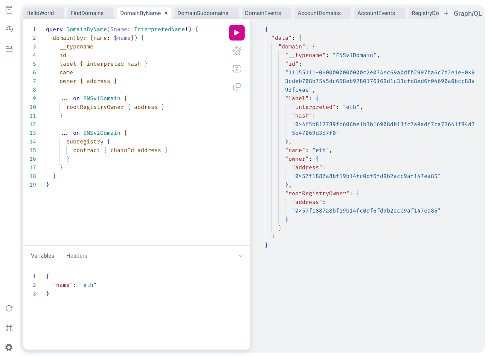
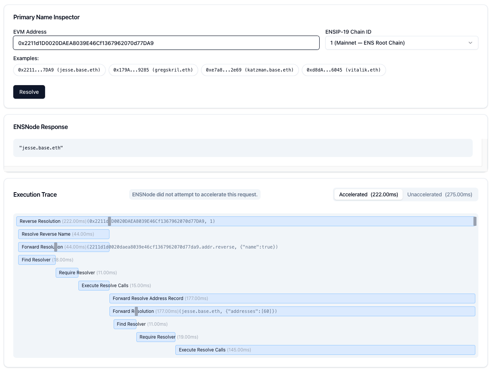
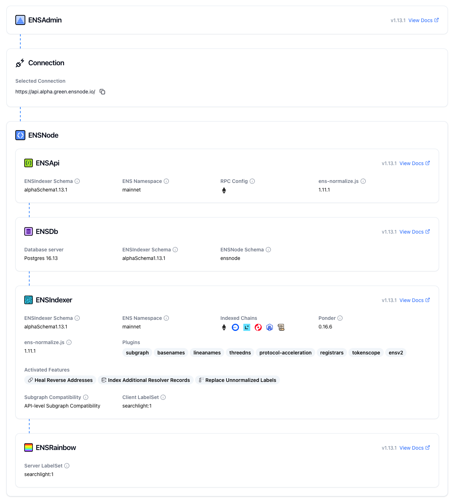
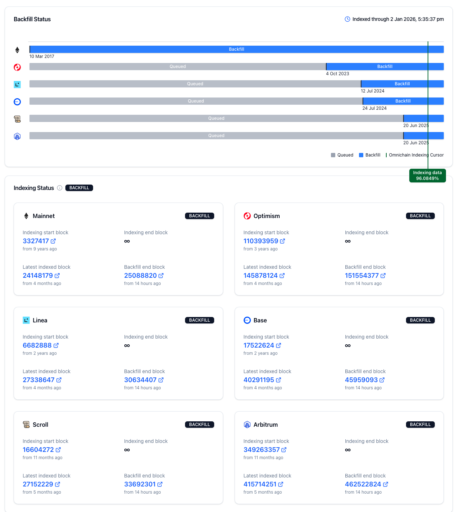

ENSAdmin is a user interface designed to help you monitor and manage your ENSNode instances effectively. It provides a clear overview of your nodes' operational status, the plugins they are currently running, and the progress of their indexing.

## Key Features

### Omnigraph API Playground

A powerful GraphQL interface for querying the new Omnigraph API of your ENSNode.

### ENS Protocol Inspector

Inspect and analyze ENSNode data in detail. For example, use the ENS Protocol Inspector for the Primary Name Resolution.

### ENSNode Stack Info

Get real-time insights into the config of all services running on your ENSNode.

### Indexing Status

Track the indexing status of your ENSNode to understand its current performance.

