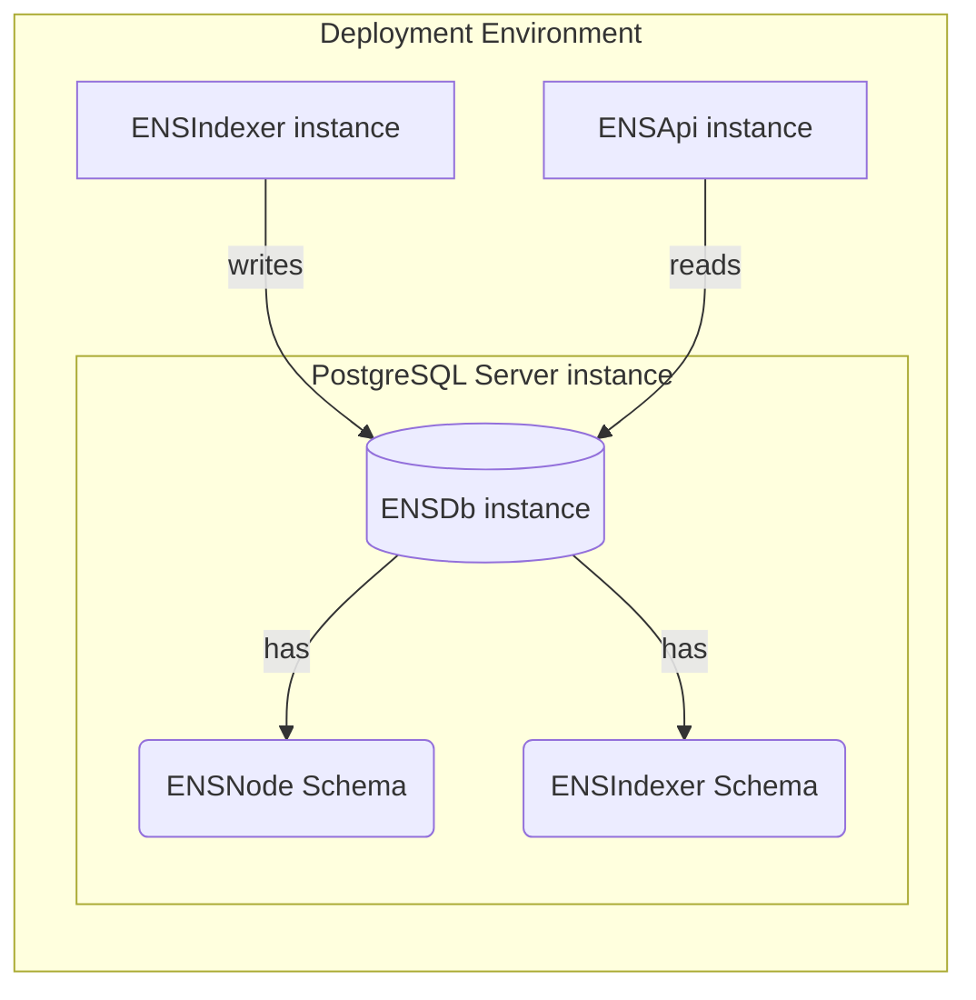

import { Aside } from '@astrojs/starlight/components';

ENSNode includes initial reference implementations of the [ENSDb standard](/docs/services/ensdb/concepts/glossary#ensdb-standard). This includes ENSIndexer as a reference ENSDb writer and ENSApi as a reference ENSDb reader. These are just a few examples of the ecosystem of tools and services that are possible when you build with ENSDb.

This initial reference implementation consists of three main components:
- An [ENSDb instance](/docs/services/ensdb/concepts/glossary#ensdb-instance) — A PostgreSQL database following the ENSDb standard.
- An [ENSIndexer instance](/docs/services/ensdb/concepts/glossary#ensindexer-instance) — A reference ENSDb Writer implementation that writes data into the ENSDb instance.
- An [ENSApi instance](/docs/services/ensdb/concepts/glossary#ensapi-instance) — A reference ENSDb Reader implementation that serves GraphQL and REST APIs.

<Aside type="tip" title="Build Your Own">
  You can build custom ENSDb Writers, or ENSDb Readers. The [ENSDb standard](/docs/services/ensdb/concepts/glossary#ensdb-standard) is implementation-agnostic.
</Aside>
