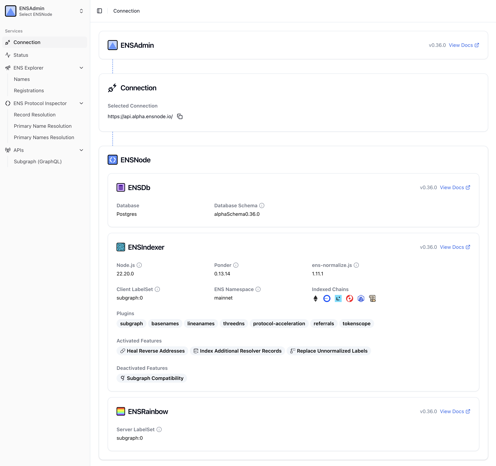

ENSAdmin is a user interface designed to help you monitor and manage your ENSNode instances effectively. It provides a clear overview of your nodes' operational status, the plugins they are currently running, and the progress of their indexing.

Key features of ENSAdmin include:

*   **ENSNode Status Monitoring:** Get real-time insights into the health of your ENSNode instances.
*   **Plugin Management:** View the plugins active on your ENSNodes.
*   **Indexing Status:** Track the indexing progress of your nodes to ensure data is up-to-date.
*   **GraphQL Playground with AI:** A powerful GraphQL interface for querying your ENSNode data. This playground is enhanced with AI capabilities to assist in generating complex GraphQL queries, making data exploration more intuitive and efficient.
