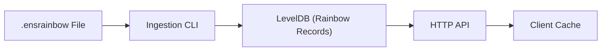

ENSRainbow stores its rainbow table in a **LevelDB** database. The schema is intentionally simple and append-only:

## Database Schema

| Component | Encoding | Description |
|-----------|----------|-------------|
| **Record Key** | 32-byte raw `labelhash` (no `0x` prefix) | Guarantees optimal prefix lookups & avoids hex-string parsing overhead. |
| **Record Value** | UTF-8 string formatted as `{labelSetVersion}:{label}` | This is produced by [`buildEncodedVersionedRainbowRecord`](https://github.com/ensdomains/ensnode/blob/main/apps/ensrainbow/src/lib/rainbow-record.ts). |
| **System Keys** | Byte arrays _not_ length 32 prefixed with `0xff…` | Hold metadata such as schema version, ingestion status, precalculated count, etc. |

## Versioned Rainbow Record

```ts
interface VersionedRainbowRecord {
  label: string;          // original label
  labelSetVersion: number;// version it belongs to
}
// Encoded on disk as: "{labelSetVersion}:{label}"
```

Storing the version alongside the label allows **incremental snapshots** to coexist. This makes deterministic client-side results across time straightforward, even as additional label set versions are ingested by ENSRainbow.

## Metadata Fields

The database keeps a handful of **system keys** that do not clash with labelhashes (their length ≠ 32 bytes):

* `0xff 0xff 0xff 0xff` → precalculated record count
* `0xff 0xff 0xff 0xfe` → ingestion status (`unstarted`/`unfinished`/`finished`)
* `0xff 0xff 0xff 0xfd` → database schema version (currently `3`)
* `0xff 0xff 0xff 0xfc` → highest label set version
* `0xff 0xff 0xff 0xfb` → label set id

## ENSRainbow File Format

A **`.ensrainbow` file** is the _on-disk representation_ of a label set. It is a compressed, append-only collection that uses **Protocol Buffers (protobuf)** as its serialization format.

#### About Protocol Buffers

Protocol Buffers is Google's language-neutral, platform-neutral extensible mechanism for serializing structured data. ENSRainbow uses protobuf because it provides:

- **Compact binary encoding** - Much smaller than JSON or XML
- **Schema evolution** - Forward and backward compatibility as the format evolves  
- **Cross-language support** - Can be read by any language with protobuf support
- **Cross-system and cross-architecture compatibility** - Works seamlessly across different operating systems (Linux, Windows, macOS) and CPU architectures (x86, ARM, etc.) without endianness concerns
- **Self-delimiting messages** - Protobuf uses **varint encoding** for field delimiters, where each field is prefixed with a tag that combines the field number and wire type. This eliminates the need for explicit field separators since the encoding itself contains all necessary boundary information.

#### Protobuf Schema

The `.ensrainbow` file format uses two main message types:

```protobuf
message RainbowRecord {
  bytes labelhash = 1;    // 32-byte labelhash
  string label = 2;       // original label string
}

message RainbowRecordCollection {
  string format_identifier = 1;              // always "ensrainbow" 
  uint32 ensrainbow_file_format_version = 2;  // file format version
  string label_set_id = 3;                    // e.g., "subgraph" 
  uint32 label_set_version = 4;               // version number
  repeated RainbowRecord records = 5;         // the actual records
}
```

#### Delimited Encoding

ENSRainbow uses protobuf's **length-delimited encoding** (`encodeDelimited`/`decodeDelimited`) where each message is prefixed with its byte length as a varint. This allows streaming multiple messages in a single file without needing explicit separators between records.

#### File Structure

The `.ensrainbow` file consists of length-delimited protobuf messages in the following order:

### 1. Header Message
A single `RainbowRecordCollection` message containing metadata (with empty `records` array):
- `format_identifier` – always "ensrainbow" (file format identifier)
- `ensrainbow_file_format_version` – file format version number
- `label_set_id` – identifier like "subgraph" (lowercase ASCII letters and hyphens, 1-50 chars)
- `label_set_version` – version number 
- `records` – empty array (records are stored separately)

### 2. Record Stream  
A sequence of individual `RainbowRecord` messages, each containing:
- `labelhash` – 32-byte hash of the label
- `label` – the original label string

Each message (header and records) is prefixed with its byte length as a protobuf varint, enabling streaming reads without loading the entire file into memory.

### File Naming Convention

The filename convention mirrors the header so humans can eyeball it quickly:

```text
subgraph_0.ensrainbow     # labelSetId = "subgraph", version = 0
subgraph_1.ensrainbow     # next version with incremental labelhash-to-label mappings added
```

## Converting Legacy SQL Data

If you have a legacy gzipped rainbow table (`ens_names.sql.gz`) from the ENS Subgraph, you can convert it to the `.ensrainbow` format:

```bash title="Convert legacy SQL data"
pnpm run convert --input-file path/to/ens_names.sql.gz --output-file subgraph-0.ensrainbow
```

This conversion process allows you to migrate existing rainbow table data that was previously stored in SQL format to ENSRainbow's optimized binary format. The resulting `.ensrainbow` file will be equivalent to the rainbow tables used by the ENS Subgraph, maintaining the same label-to-labelhash mappings while providing better performance and storage efficiency.

## Ingestion Process

During **ingestion** ENSRainbow:

1. Reads the header first
2. Validates it against any existing database metadata
3. Streams each pair, converting the plain _label_ into an **encoded versioned rainbow record** (`{labelSetVersion}:{label}`)
4. Writes it to LevelDB

Importing `subgraph_1.ensrainbow` will increment `SYSTEM_KEY_HIGHEST_LABEL_SET_VERSION` to `1` and mark the previous snapshot as superseded, while still allowing clients pinned to version `0` to heal deterministically.

## Data Flow Overview



## Related Documentation

- **[Glossary](/ensrainbow/concepts/glossary)** - Key terms like System Key, Ingestion, etc.
- **[Label Sets & Versioning](/ensrainbow/concepts/label-sets-and-versioning)** - Understanding the versioning system
- **[TypeScript Interfaces](/ensrainbow/concepts/typescript-interfaces)** - Type definitions for working with the data 
